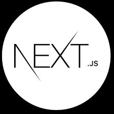
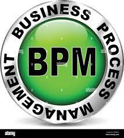

Hi there. i'm mohsen, a happy developer

**About me**

a full-stack developer that uses linux.  
i'd be glad to collabrate in open source projects.  
keep in touch with me via mohsenjalali79.mj@gmail.com  
my linkedin https://www.linkedin.com/in/mohsen-jalali-0b589b1b5/

 

## Skills

  |    |   |  
:-------------------------:|:-------------------------:|:-------------------------:|:-------------------------:
<a href="https://developer.mozilla.org/en-US/docs/Web/HTML">HTML</a> | <a href="https://developer.mozilla.org/en-US/docs/Web/CSS">CSS</a> | <a href="https://developer.mozilla.org/en-US/docs/Web/JavaScript">Javascript</a> | <a href="https://www.php.net/">PHP</a>

 

## Frameworks and Libraries

  |    |  
:-------------------------:|:-------------------------:|:-------------------------:|
<a href="https://react.dev/">React</a> | <a href="https://nextjs.org/">Next</a> | <a href="https://laravel.com/">Laravel</a>

 

## Experienced with

  |    |   |   |  
:-------------------------:|:-------------------------:|:-------------------------:|:-------------------------:|:-------------------------:|
<a href="https://jestjs.io/">Jest</a> | <a href="https://vitest.dev/">Vitest | <a href="https://socket.io/">socket.io</a> | <a href="https://sass-lang.com/">Sass</a> | <a href="https://getbootstrap.com/">Boostrap</a>

  |    |   |   |  
:-------------------------:|:-------------------------:|:-------------------------:|:-------------------------:|:-------------------------:|
<a href="https://doc.qt.io/qt-6/qtqml-index.html">QML</a> | <a href="https://graphql.org/">Graphql</a> | <a href="https://en.wikipedia.org/wiki/BPM">BPM</a> | <a href="https://www.mysql.com/">MySql</a> | <a href="https://redis.io/">Redis</a>
