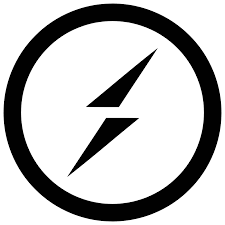

Hi there. i'm mohsen, a happy developer

**About me**

a full-stack developer that uses linux.  
i'd be glad to collabrate in open source projects.  
keep in touch with me by mohsenjalali79.mj@gmail.com  
my linkedin https://www.linkedin.com/in/mohsen-jalali-0b589b1b5/

 

**Skills**

 

  
  
HTML

  

  

  
  
CSS

  

  

  
  
Javascript

  

  

  
  
PHP

  

 

**Frameworks and Libraries**

  
  
React

  

  

  
  
Next

  

  

  
  
Laravel

  

 

**Experienced with**

 

  
  
Jest

  

   

  
  
Vitest

  

   

  
  
Socket.io

  

   

  
  
Sass

  

   

  
  
Bootstrap

  

  

  

   

  
  
QML

  

   

  
  
Graphql

  

   

  
  
BPM

  

   

  
  
MySql

  

   

  
  
Redis

  

