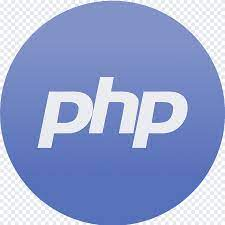
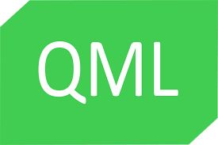
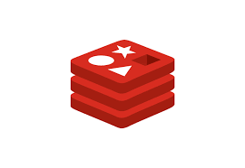

Hi there. i'm mohsen, a happy developer

**About me**

a full-stack developer that uses linux.  
i'd be glad to collabrate in open source projects.  
keep in touch with me by mohsenjalali79.mj@gmail.com  
my linkedin https://www.linkedin.com/in/mohsen-jalali-0b589b1b5/

 

## Skills

  |    |   |  
:-------------------------:|:-------------------------:|:-------------------------:|:-------------------------:
HTML | CSS | Javascript | PHP

 

## Frameworks and Libraries

  |    |  
:-------------------------:|:-------------------------:|:-------------------------:|
React | Next | Laravel

 

## Experienced with

  |    |   |   |  
:-------------------------:|:-------------------------:|:-------------------------:|:-------------------------:|:-------------------------:|
Jest | Vitest | socket.io | Sass | Bootstrap

  |    |   |   |  
:-------------------------:|:-------------------------:|:-------------------------:|:-------------------------:|:-------------------------:|
QML | Graphql | BPM | MySql | Redis